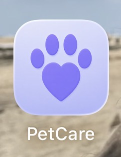
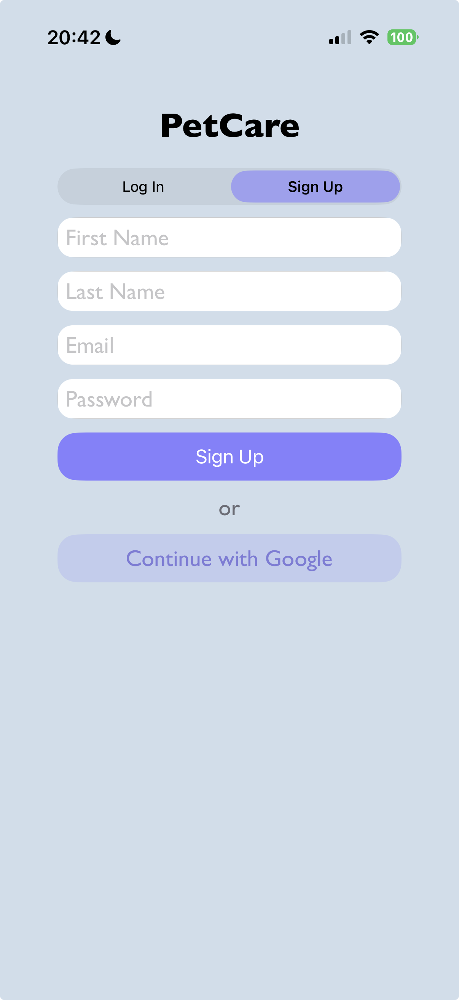
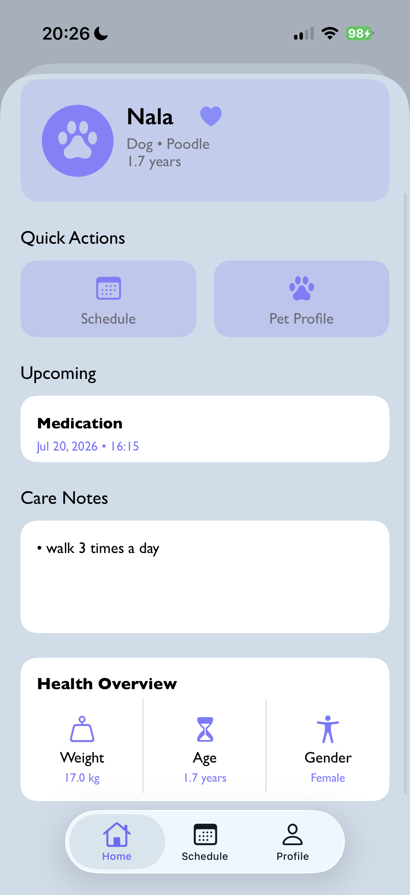
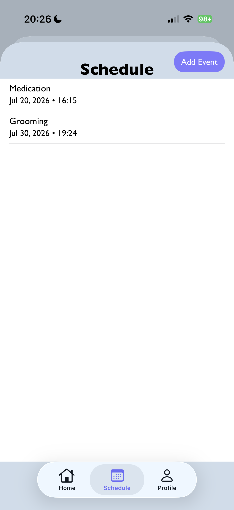
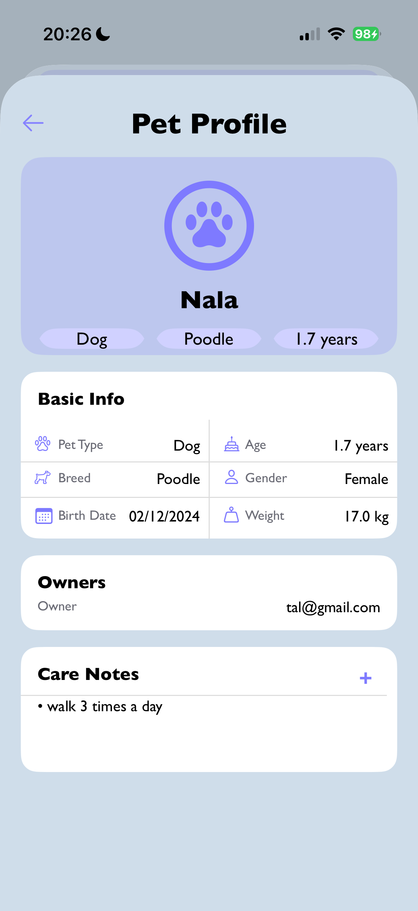
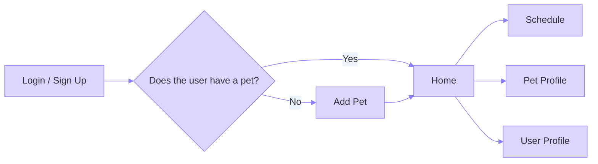

<div align="center">



# PetCare

### A simple iOS app for managing a pet's profile, care notes, and upcoming events

<p align="center">
  Swift • UIKit • Firebase Authentication • Cloud Firestore
</p>

</div>

---

## About the App

**PetCare** is an iOS application that helps pet owners keep essential information in one convenient place.  
Users can create an account, add their pet's details, manage care notes, schedule events, and view the closest upcoming event directly from the Home screen.

The app stores user-specific data securely with **Firebase Authentication** and **Cloud Firestore**.

## App Preview

<table>
  <tr>
    <td align="center"><strong>Sign Up</strong></td>
    <td align="center"><strong>Home</strong></td>
    <td align="center"><strong>Schedule</strong></td>
    <td align="center"><strong>Pet Profile</strong></td>
  </tr>
  <tr>
    <td></td>
    <td></td>
    <td></td>
    <td></td>
  </tr>
</table>

## Demo Video

<div align="center">

### [▶ Watch the Full PetCare Demo on Google Drive](https://drive.google.com/file/d/1r7l2n5bsNkToS0DVl6fU4iVv13k_hJFY/view?usp=sharing)

_Click the link above to open the full application demonstration._

</div>

## Main Features

- Email and password registration and login
- Google Sign-In
- User-specific data secured with Firestore Security Rules
- First-pet onboarding flow
- Pet profile containing:
  - Name
  - Pet type
  - Breed
  - Birth date and calculated age
  - Weight
  - Gender
  - Care notes
- Personalized Home screen
- Health overview
- Closest upcoming event
- Care-note management
- Event scheduling with:
  - Vet appointments
  - Vaccinations
  - Grooming
  - Medication
  - Other events
- Upcoming and past event display
- User profile and logout
- Light and Dark Mode support

```md
## Application Flow


```

## Technologies

| Category | Technology |
|---|---|
| Language | Swift 5 |
| User Interface | UIKit, Storyboard, Auto Layout |
| Authentication | Firebase Authentication, Google Sign-In |
| Database | Cloud Firestore |
| Dependency Management | Swift Package Manager |
| Development Environment | Xcode |

## Firestore Structure

```text
users/{userId}
├── email
├── firstName
├── lastName
└── petIds[]

pets/{petId}
├── name
├── type
├── breed
├── birthDate
├── weight
├── gender
├── notes
└── ownerId

pets/{petId}/events/{eventId}
├── type
├── date
├── notes
├── addedBy
└── createdAt
```

Firestore Security Rules ensure that authenticated users can access only their own user document, pets, and pet events.

## Requirements

- macOS with Xcode installed
- An iOS 26.5 simulator or compatible device
- Internet connection for Firebase and Google Sign-In

## How to Run

1. Clone or download the repository.
2. Open `PetCare.xcodeproj` in Xcode.
3. Wait for Swift Package Manager to resolve the Firebase and Google Sign-In packages.
4. Make sure `GoogleService-Info.plist` is included in the `PetCareShared` target.
5. Select an iOS simulator.
6. Press **Command + R** to build and run the app.
7. Create a new account or sign in with an existing account.

> No CocoaPods installation or additional terminal commands are required.

## Main Files

```text
PetCare/
├── README.md
├── Media/
│   ├── logo.jpg
│   ├── signup.png
│   ├── home.png
│   ├── schedule.png
│   └── pet-profile.png
├── PetCare.xcodeproj/
└── PetCareShared/
    ├── LoginController.swift
    ├── AddPetController.swift
    ├── HomeController.swift
    ├── ScheduleViewController.swift
    ├── PetProfileViewController.swift
    ├── ProfileViewController.swift
    ├── EventCell.swift
    ├── MyExtensions.swift
    ├── AppDelegate.swift
    ├── SceneDelegate.swift
    ├── Assets.xcassets/
    ├── Base.lproj/
    ├── GoogleService-Info.plist
    └── Info.plist
```

---

<div align="center">

Developed by **Shani Shalev**

</div>
